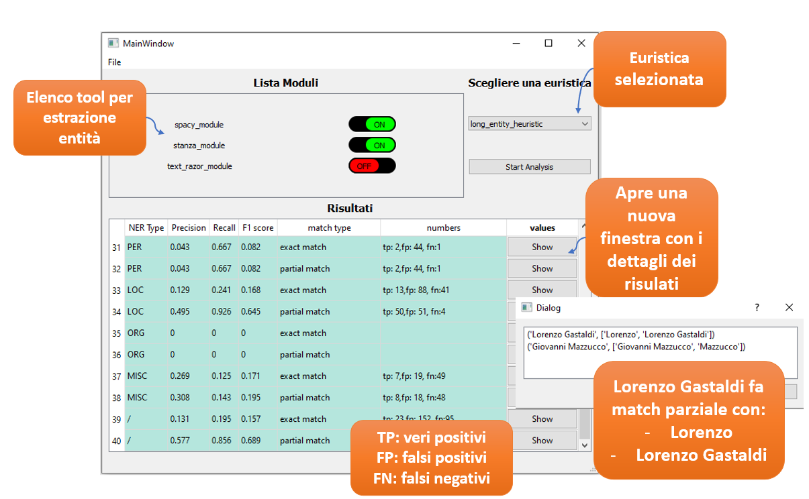
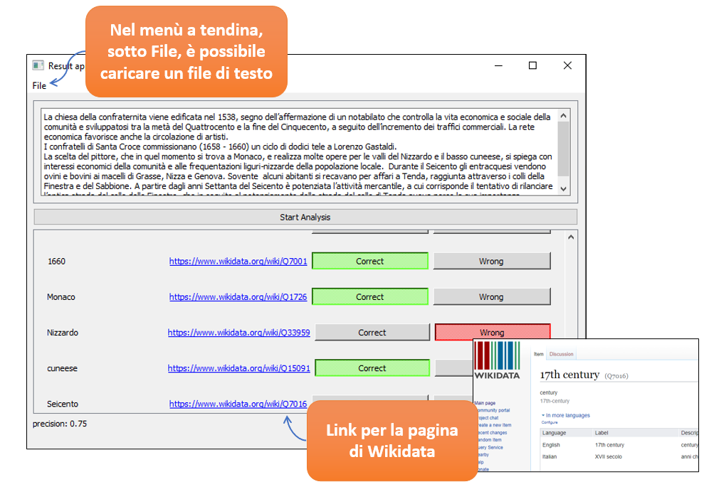

# HSG module Storytelling2Knowledge

The main code of the module is in the main directory

In application_test_control there is the automatic test based on omekas database

In application_manual_valuation there is the application for manual test that print all the entity extracted with classes or wikidata-url. 
In test_example there are 3 narration to test this app ( there is a load file command in the File menù)

note: each application has a readme file

### ADD module
For add a new extractor module or heuristic, follow readme instruction in main.individual_extractor directory